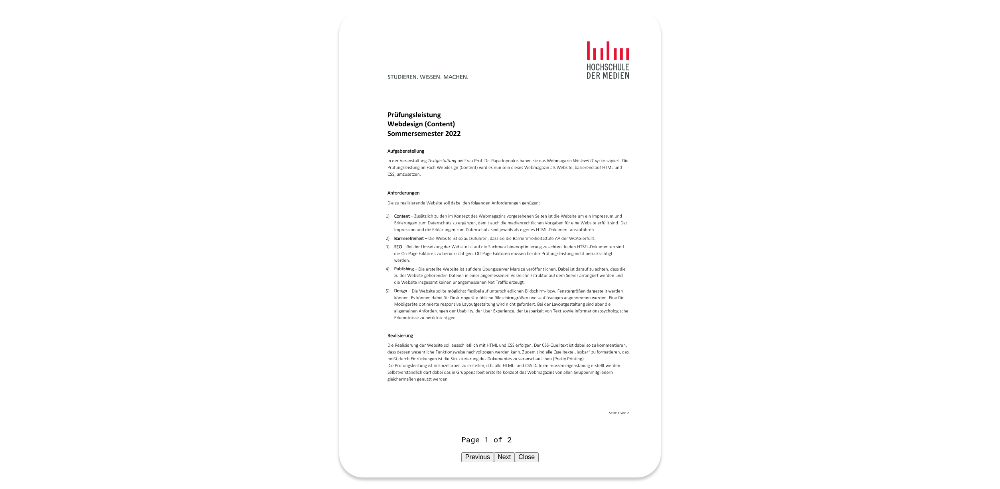

<p align="center">
  <a href="https://www.gatsbyjs.com/?utm_source=starter&utm_medium=readme&utm_campaign=minimal-starter">
    
  </a>
</p>
<h1 align="center">
  Gatsby minimal starter
</h1>

## 🚀 Quick start

1.  **Install dependencies.**

    ```shell
    npm install
    ```

    or

    ```shell
    yarn install
    ```

2.  **Run project.**

    ```shell
    npm run develop
    ```

3.  **Open the code and start customizing!**

    Your site is now running at http://localhost:8000!

    Edit `src/pages/index.js` to see your site update in real-time!

## Preview


